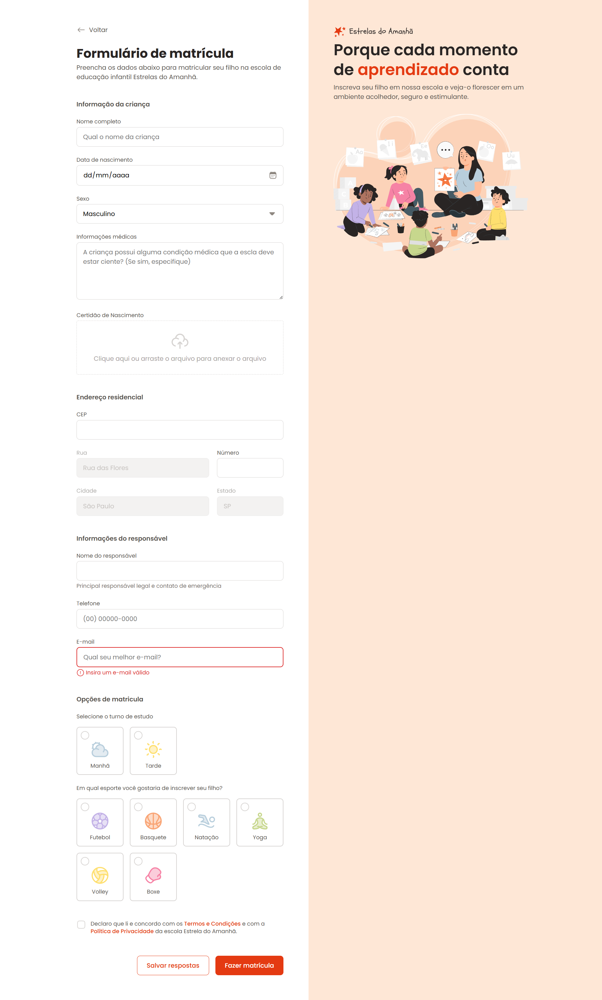

# Formulario de Matricula - Estrelas do Amanha

Projeto de uma pagina web estatica para formulario de matricula da escola de educacao infantil **Estrelas do Amanha**. A interface foi construida com HTML e CSS puro, usando uma estrutura visual dividida entre formulario e area ilustrativa institucional.

## Preview



## Sobre o projeto

O formulario permite simular o processo de matricula de uma crianca em uma escola infantil. A pagina possui campos para dados da crianca, endereco residencial, informacoes do responsavel, selecao de turno, escolha de esporte e aceite dos termos.

Este projeto e ideal para praticar:

- Estruturacao semantica com HTML.
- Organizacao de formularios complexos.
- Estilizacao modular com CSS.
- Uso de assets locais, icones SVG e imagem ilustrativa.
- Estados visuais de campos, botoes, radios, checkboxes e area de upload.

## Funcionalidades

- Layout em duas colunas com formulario e area visual.
- Campos de texto, data, telefone, e-mail, numero e textarea.
- Campo de selecao para sexo.
- Area de upload para certidao de nascimento.
- Opcoes de turno com radio buttons personalizados.
- Opcoes de esporte com icones.
- Checkbox personalizado para aceite de termos.
- Botoes para salvar respostas e fazer matricula.
- Validacao nativa de e-mail por HTML.

## Tecnologias utilizadas

- HTML5
- CSS3
- Google Fonts
- SVGs locais

## Estrutura de pastas

```text
.
+-- assets/
|   +-- icons/
|   +-- Illustration.svg
|   +-- logo.svg
|   +-- print.png
+-- styles/
|   +-- fields/
|   +-- forms.css
|   +-- global.css
|   +-- index.css
|   +-- layout.css
+-- index.html
+-- README.md
```

## Como executar

Como o projeto e estatico, nao e necessario instalar dependencias.

1. Baixe ou clone este repositorio.
2. Abra o arquivo `index.html` diretamente no navegador.

Tambem e possivel usar uma extensao como **Live Server** no VS Code para visualizar alteracoes em tempo real.

## Arquivos principais

- `index.html`: contem toda a estrutura da pagina e dos campos do formulario.
- `styles/index.css`: importa os demais arquivos CSS.
- `styles/global.css`: define reset, variaveis globais, fontes e cores.
- `styles/layout.css`: controla a estrutura principal da pagina.
- `styles/forms.css`: organiza fieldsets, legends e acoes do formulario.
- `styles/fields/`: contem os estilos especificos de inputs, botoes, radios, checkboxes e area de upload.
- `assets/`: armazena logo, ilustracao, imagem de preview e icones.

## Personalizacao

Voce pode adaptar o projeto alterando:

- Cores globais em `styles/global.css`.
- Textos, labels e opcoes do formulario em `index.html`.
- Logo e ilustracao em `assets/`.
- Imagem de preview usada neste README em `assets/print.png`.
- Campos obrigatorios adicionando ou removendo o atributo `required` no HTML.

## Observacoes

- O formulario possui apenas a interface visual. O envio via `POST` esta indicado no HTML, mas ainda nao ha backend configurado para receber os dados.
- Os campos de endereco `Rua`, `Cidade` e `Estado` aparecem desabilitados e preenchidos como exemplo.
- Para publicar online, o projeto pode ser hospedado em servicos como GitHub Pages, Netlify ou Vercel.

## Possiveis melhorias

- Corrigir acentuacao dos textos caso o arquivo esteja salvo com codificacao incorreta.
- Adicionar responsividade para telas menores.
- Implementar integracao com API de CEP.
- Criar validacoes customizadas com JavaScript.
- Enviar os dados para um backend ou servico de formularios.
- Mostrar nome do arquivo selecionado na area de upload.

## Autor

Desenvolvido como projeto de estudo de HTML e CSS.
